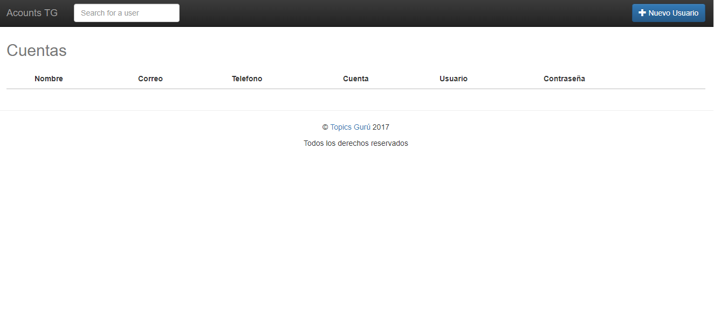
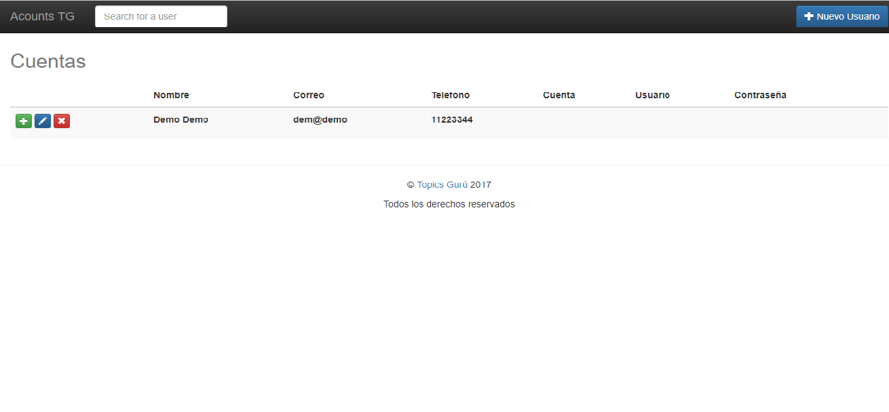
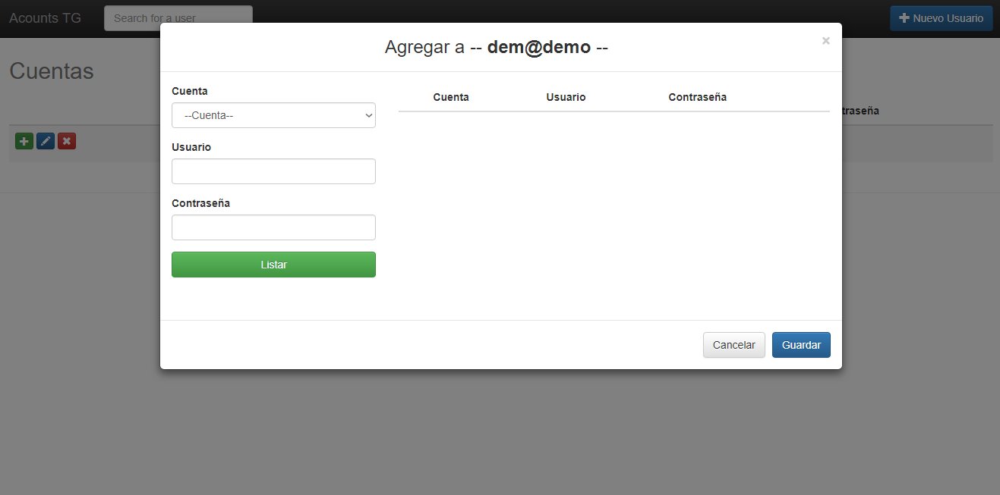
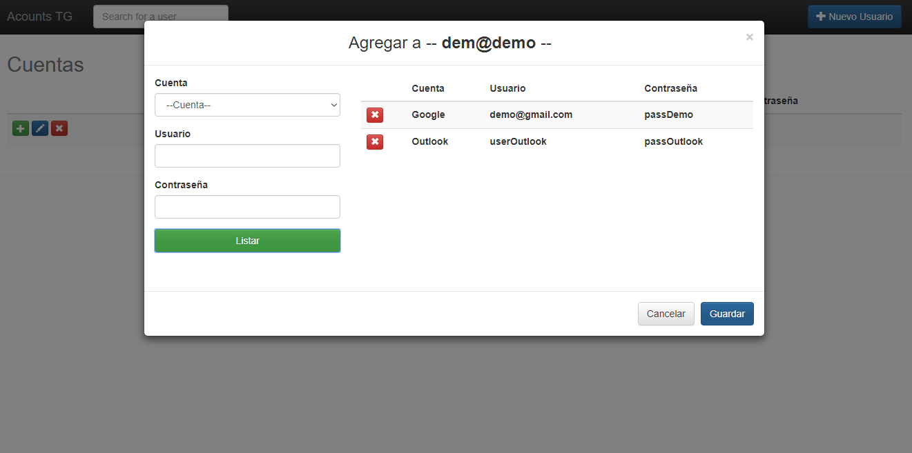
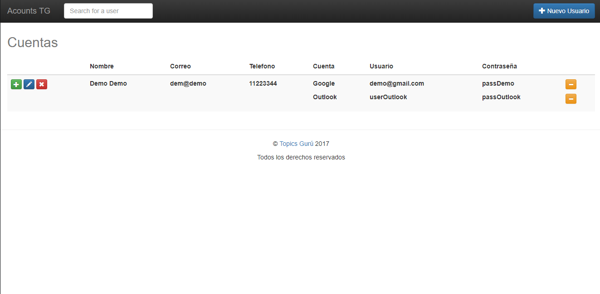

# control-de-cuentas-personales
	Aplicacion web para gestionar el control de distintas cuentas, esta escrito en AngularJS con PHP.
	
	Cabe mencionar que esto no cuenta con nada de seguridad, y por los datos que se manejar es un sistema delicado.
	Por eso aclaro que no me hago cargo de lo que pueda pasar. 
	Toda la parte de seguridad corre por cuenta de quien use esto...

# 1 - Para configurar la base de datos:

	a) Ejecutar phpMyAdmin y correr el script "db.slq" que se encuentta al mismo nivel que este archivo.

	b) Configura el archivo "public_html/server/configConection.php":
		("server", "TU_SERVIDOR") => "localhost" si lo estas coriendo en un servidor local, "IP or hosting name" 
					      si lo corres desde un dominio propio
		("userDB", "TU_USUARIO_DB") => Depende de como este configurado tu phpMyAdmin
		("passDB", "TU_PASS_DB") => Depende de como este configurado tu phpMyAdmin
		("db", "mydb") => Este es el nombre actual de la base de datos

# 2 - Agregar cuentas a la DB
	
	Esto se hace desde phpMyAdmin dentro de la tabla "acount", si esta tabla se queda vacia no se veran los resultados
	en la parte 4 - Agregar Cuentar

# 3 - Agregar Usuario

# 4 - Agregar Cuentas
	

# ------

